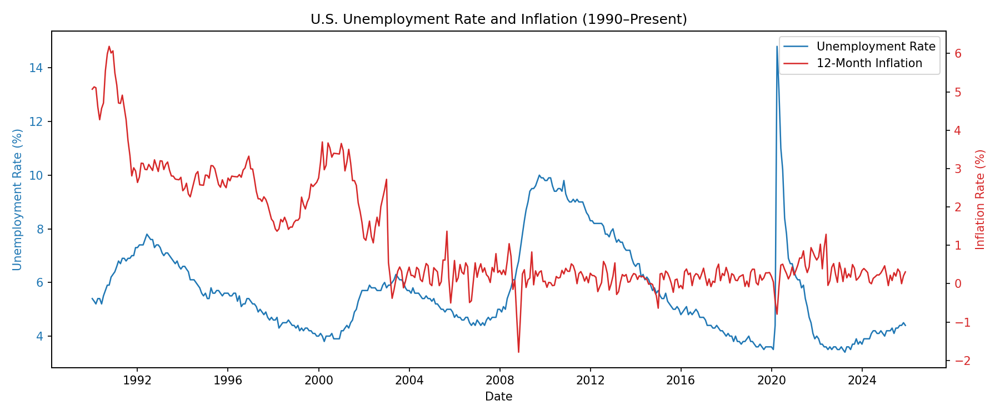
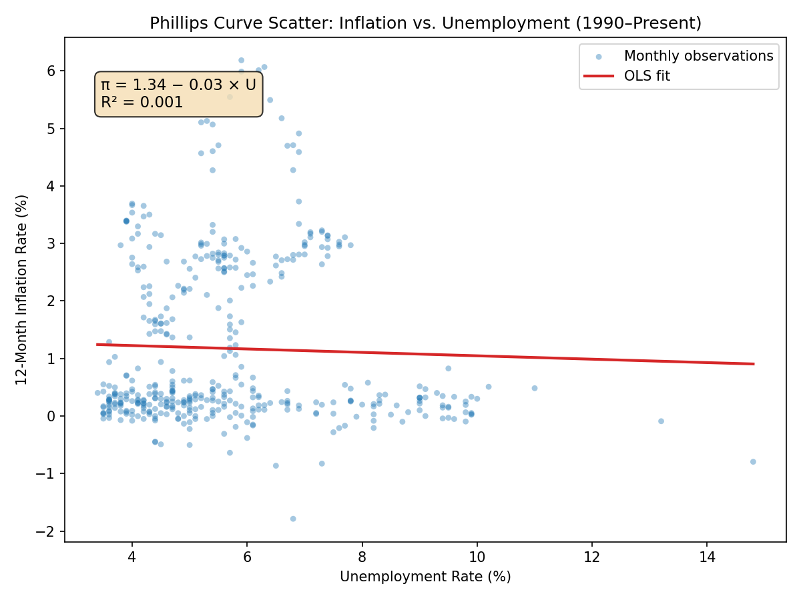

# Phillips Curve Analysis: U.S. Unemployment vs. Inflation (1990–2025)

## Overview

This analysis examines the relationship between the U.S. unemployment rate (UNRATE) and CPI-derived inflation (CPIAUCSL) from January 1990 through December 2025. Inflation is computed as the 12-month log-difference of the Consumer Price Index:

$$\pi_t = 100 \times (\log(\text{CPI}_t) - \log(\text{CPI}_{t-12}))$$

An OLS regression is estimated with inflation as the dependent variable and unemployment as the independent variable.

## Data

| Series | Source | Frequency | Observations |
|--------|--------|-----------|--------------|
| UNRATE (Unemployment Rate, %) | FRED / master_workbook.xlsx | Monthly | 432 |
| CPIAUCSL (CPI All Urban, Index) | FRED / master_workbook.xlsx | Monthly | 432 (after merge) |

**Sample period:** 1990-01 to 2025-12

## OLS Regression Results

**Model:** inflation = β₀ + β₁ × unemployment + ε

| Parameter | Estimate | Std. Error |
|-----------|----------|------------|
| Intercept (β₀) | 1.3430 | 0.2376 |
| Slope (β₁) | −0.0296 | 0.0400 |

| Statistic | Value |
|-----------|-------|
| R² | 0.0013 |
| N | 432 |

## Interpretation

- **Slope (β₁ = −0.030):** A 1 percentage-point increase in the unemployment rate is associated with a 0.030 percentage-point *decrease* in 12-month inflation. The negative sign is consistent with the Phillips Curve — higher unemployment coincides with lower inflation — but the effect is economically very small.

- **R² = 0.001:** Unemployment alone explains only about 0.1% of the variation in inflation over this period. The simple bivariate Phillips Curve relationship has been essentially flat since 1990, reflecting the well-documented "flattening" of the Phillips Curve in recent decades.

- **Why so weak?** Post-1990 inflation dynamics are driven primarily by anchored expectations, supply-side shocks (oil, supply chains), and monetary policy rather than labor market slack alone. The COVID-era unemployment spike (14.7% in April 2020) and the subsequent 2021–2022 inflation surge further complicate the simple relationship, since those events were driven by unique pandemic-related supply and demand disruptions.

## Charts

### 1. Time-Series: Unemployment and Inflation (Dual Y-Axis)



The dual-axis plot highlights key episodes: the early-1990s recession, the dot-com era low unemployment, the 2008 financial crisis, and the dramatic COVID-era spike in unemployment followed by the 2021–2022 inflation surge.

### 2. Scatter Plot with OLS Fit



The scatter plot shows the near-flat regression line (π = 1.34 − 0.03 × U), confirming that the simple unemployment-inflation tradeoff is negligible in the modern era. The wide dispersion of points around the line is consistent with the very low R².

## Reproduction

```bash
python results/unemployment_inflation_analysis.py
```

Requires: numpy, pandas, matplotlib, statsmodels, openpyxl. Data is read from `data/master_workbook.xlsx`.
